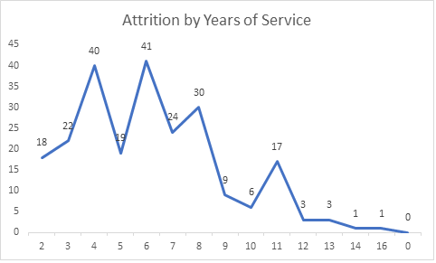
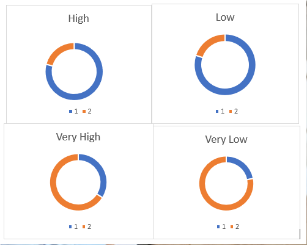
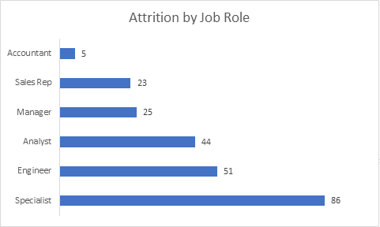
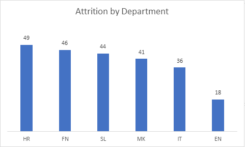
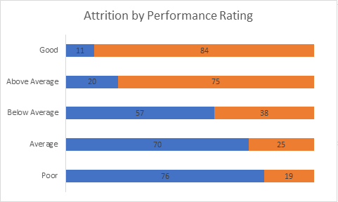
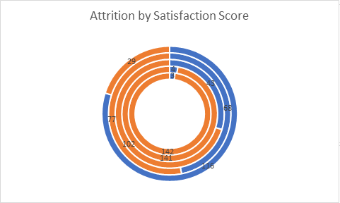
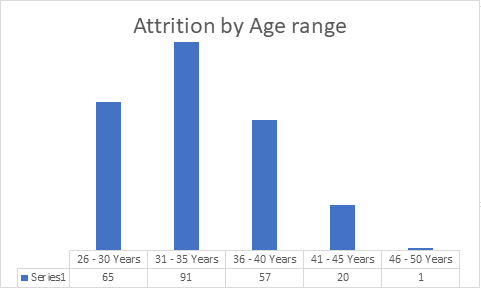
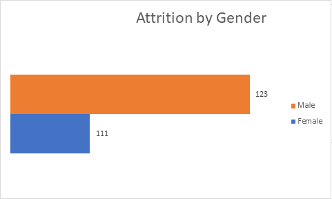
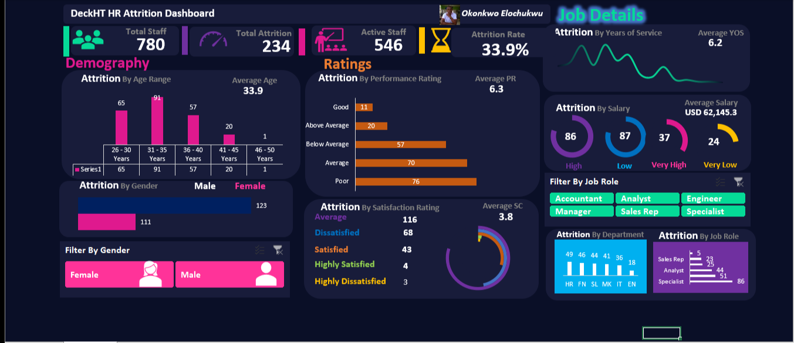

# HR ATTRITION Dashboard

# INTRODUCTION
DeckHT company is experiencing increase in employee attrition rates, impacting productivity, morale and the overall organizational performance. This Excel project shows analysis of HR and employee data, including demographics, job roles, performance metrics and workplace satisfaction.

# PROBLEM STATEMENT
•	To identify the underlying causes and predictions of employee attrition

•	To develop predictive models that can help HR department and management  take proactive measures to reduce attrition, improve employee retention, and create more stable and satisfying workforce. 

# DATA SOURCE
I  downloaded the Excel worksheet from google drive link https://drive.google.com/file/d/1YnO1AzdoC8zYxj-hXYFxfsHDB-tbAc_b/view?usp=sharing
 and then extracted into my Excel application power query for proper cleaning and transformation. 
Please note that this dataset and report do not represent any real organization; they are simply a demonstration of my proficiency in the use of Microsoft Excel The dataset has 10 columns and 780 rows. Column names includes EmployeeID, Age, Gender, Department, Job role, Years of service, Performance rating, Satisfaction score, Salary and Attrition.  

# SKILLS DEMONSTRATED

•	Data extraction

•	Data cleaning

•	Data Transformation

•	Data Modelling

•	Data visualization

•	Data analysis

•	Critical thinking

•	Problem solving.

# DATA CLEANING
•	Removed unnecessary rows

•	Removed unnecessary columns

•	Split data in different columns

•	Used first row as headers

•	Checked all columns and ensured data types are correct

•	Trimmed all columns and removed spaces

# DATA TRANSFORMATION
During data transformation, I carried out the following using Power Query;

•	Replaced values of Department column with initials (e.g Sales with SL) 

•	Created data range for Age, Performance rating, Satisfaction score, Salary and Attrition columns respectively 

•	Applied Conditional statements on the created data ranges

# DATA MODELLING
I worked with one dataset, so I used Pivot Table to extract values of all columns with numeric values which I used as KPIs listed below.
1.	Total Employees
2.	Total Staff
3.	Total Attrition
4.	Active Staff
5.	Attrition Rate

# DATA ANALYSIS AND VISUALIZATION
I proceeded to analyze the data step by step according to the questions and aim of the project.
### Attrition by Years of Service

The analysis was visualized using Line Chart.

### Attrition by Salary
This was visualized using doughnut chart. The blue color indicates Attrition by salary

### Attrition by Job Role
This was visualized using clustered bar chart. Here it was observed that the Specialist has the highest attrition rate.

### Attrition by Department
This was visualized using bar chart. Here it was discovered that the HR department has the highest attrition rate.

### Attrition by Performance Rating
This was visualized using clustered bar chart. The blue color indicates Attrition by Performance rating. Here it was discovered that the company staff have poor performance rating. 

### Attrition by Satisfaction Score
This was visualized using spiral chart. The blue color indicates Attrition by Satisfaction score. Here it was discovered that the company staff have low satisfaction score. performance rating. 

### Attrition by Age Range
This was visualized using bar chart. Here it was discovered that more staff fall within the ages of 31-35.

### Attrition by Gender
This was visualized using clustered bar chart. Here it was discovered that there is high attrition rate among male staff than female.

The dashboard is an interactive one and so further findings can be explored. click here [GitHub](https://bit.ly/3HM1ngV) to interact with the dashboard

# SLICERS
Two slicers were included;

i.	Filter by Gender

ii.	Filter by Job roles

# DASHBOARD

# INSIGHTS/RECOMMENDATIONS 
1. The organization is experiencing a notable elevation in attrition rates – 34.2%. 

#### Recommendation: 
Retention Programs: Implement targeted retention programs to address the overall high attrition rate.

2. There is a discernible disparity in attrition rates, with a higher occurrence observed among female employees compared to their male counterparts as seen in Specialist job role.

#### Recommendation:
Gender-Specific Initiatives: Develop initiatives specifically tailored for female staff to reduce their attrition.

3. Employees exhibit a prevalence of poor performance ratings.

#### Recommendation:
Performance Improvement Plans: Focus on improving performance by providing training and support to underperforming employees.

4. A substantial proportion of the workforce falls within the age bracket of 31-35 years.

#### Recommendation:
Age-Group Targeting: Tailor retention strategies for employees aged 31-35 to address specific concerns or needs within this demographic.

5. A gender-based income differential is evident, with female staff earning comparatively less than their male counterparts especially in the Specialist Department.

#### Recommendation:
Equal Pay Review: Conduct a comprehensive review of pay structures to address gender pay gaps and promote fairness.

# CONCLUSION:
In conclusion, our analysis reveals several critical areas that require attention. The company is grappling with a high attrition rate, particularly among female staff, who also face lower earnings compared to their male counterparts. Poor performance ratings among employees and a concentration of staff in the 31-35 age group further emphasize the need for targeted interventions. Addressing these issues through comprehensive retention programs, gender-sensitive initiatives, performance improvement plans, and age-specific strategies will be essential for fostering a more stable and equitable work environment.

## Thank you for Reading
